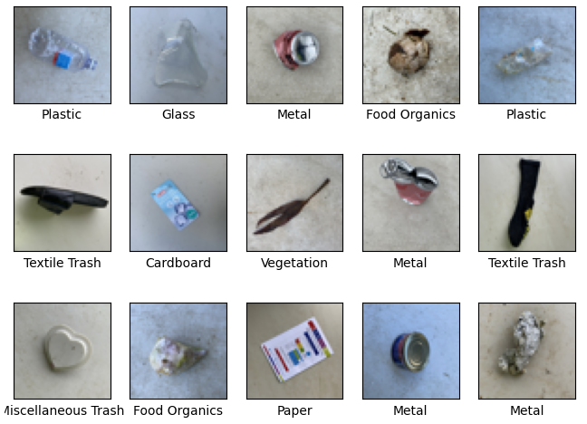
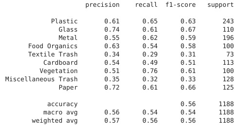
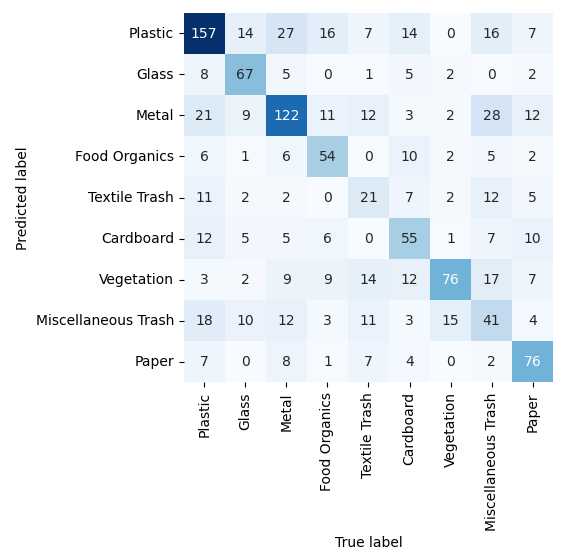

# SVM Classification on Waste Images

The notebook was created using the 05.07 Support Vector Machines notebook available in the [Python Data Science Handbook Github Repository](https://github.com/jakevdp/PythonDataScienceHandbook).

This repository contains a [Jupyter](https://jupyter.org/) Notebook for the training of a [Support Vector Machine classifier model](https://scikit-learn.org/stable/modules/svm.html) for classifying different images of waste.

### Libraries

- [Scikit Learn](https://scikit-learn.org/stable/) — Loading data, training model
- [Matplotlib Pyplot](https://matplotlib.org/stable/) — Visualising results
- [Pickle](https://docs.python.org/3/library/pickle.html) — Saving and loading model
- [Numpy](https://numpy.org/) — Processing data
- [Pillow](https://pillow.readthedocs.io/en/stable/) — Importing and manipulating images.

### Data

The dataset used is a collection of images of various items of waste that has been collected from a real life waste facility in Australia. The data itself was downloaded from [UC Irvine Machine Learning Repository](https://archive.ics.uci.edu/dataset/908/realwaste). The repository of images was created for the following article: [RealWaste: A Novel Real-Life Data Set for Landfill Waste Classification Using Deep Learning](https://www.mdpi.com/2078-2489/14/12/633).

The dataset is made up of a total of 4752 images consisting of the the following categories and the number of images in each category:

- Cardboard: 461
- Food Organics: 411
- Glass: 420
- Metal: 790
- Miscellaneous Trash: 495
- Paper: 500
- Plastic: 921
- Textile Trash: 318
- Vegetation: 436

### Process

The following procedure is used in the Jupyter Notebook ([Ipynb](Notebooks/SVM_Classification.ipynb), [PDF](Notebooks/SVM_Classification.pdf)) to process and visualise the data:

1. The first half of the notebook is an exercise on content in the 05.07 Support Vector Machines notebook, and the classifying of waste images starts at the **Classifying waste images** heading.
2. The paths of all of the images is first collected into an array which is then shuffled so that the data would be in random order for the training of the model. It is faster and more efficient to do this now instead of loading in all of the images then trying to shuffle those.
3. When the images are loaded in, they are resized to a smaller size to again be more performat on the system, as the full 524 by 524 pixel sized images take up a lot of space in memory.

   _Grid of pictures showing waste images:_  
   

4. Next some component data was extracted using the **Principal Component Analysis** method in Scikit-Learn to help with training the model. Without this step the model performed quite poorly only reaching an f1-score of about 0.35.

5. The dataset is plit into training and testing sets, and a **GridSearchCV** is used to find the optimal values for **C** and **gamma** for the **SVC** (Support Vector Classification) model. For this dataset the best foun was **C** as 5, and **gamma** as 0.01.

6. The metrics of the resulting model is tested and shown.

   _Classification Report for SVC model:_  
   

   _Confusion Matrix for SVC model:_  
   

7. Finally the model is saved to disk, and is ready to be used with an input image.

### Further Work

One important finding was that the model was not able to predict very well the images with **Textile Trash** and **Miscellaneous Trash** on them. These two categories only get around 0.35 f1-scores. However after removing these two categories from the dataset, the model f1-score incerased from around 0.57 to around 0.66.

This result could be achieved by using two seperate models one trained just on the **Textile Trash** and **Miscellaneous Trash** and a second one on the rest. This would allow the two models to work together and potentially get even better scores.
